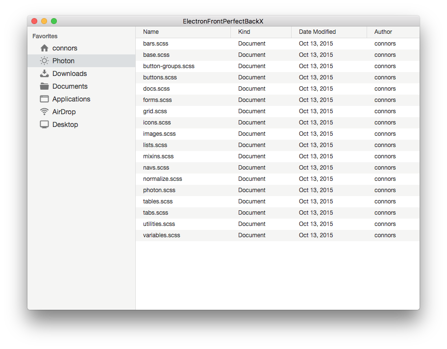

# ElectronFrontPerfectBackX
Demo macOS Application that is separated in Electron Frontend and Swift Perfect Backend

This Demo should show how to seperate the frontend of an application usning [Electron](https://electron.atom.io) with [Photon Styling](http://photonkit.com) and the backend using Swift and the [Perfect Frameowrk](http://perfect.org)

## How does it work
Electron for the frontend makes it simple to build native looking application coded with HTML, CSS and Javascript.
Because it use Javascript the Frontend can request and response data from a server, like in every Client-Server enviroment.

In this case here, the server is a local running webserver realized by the Swift Perfect Framework. 

So the Server-App has a REST-API and the Frontend-App can call the API as simple as normale (GET, POST, DELETE, PATCH)

[Read Blog Entry](https://miralem-cebic.de/blog/index.php?controller=post&action=view&id_post=5)